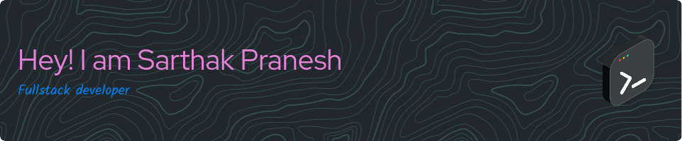

### Who am I?
---
I'm a software developer proficient in developing scalable and maintainable code throughout various platforms. In my leisure time I like developing apps with React Native, React and Golang.

 

### Goals this year
---
- Learn Blockchain, Flutter and Golang (in-depth)
- Create projects:
    - [ ]  NFT (Blockchain) project with React Native
    - [ ]  Cross platform (Web, Android, Linux) note taking app with Flutter
    - [ ]  Image resize web app using go templates
- Write blogs on
    - [ ]  Web Assembly with Golang
    - [ ]  Cross platform development
    - [ ]  add more….
- Start an open source organization

 

### Statistics
---

 

### Connect with me
---
[Website](https://www.sarthak.work/) | [Twitter](https://twitter.com/SarthakPranesh) | [Linkedin](https://www.linkedin.com/in/sarthakpranesh/) | [Product Hunt](https://www.producthunt.com/@sarthak_pranesh) |  [Email](mailto:sarthakpranesh08@gmail.com)

 
